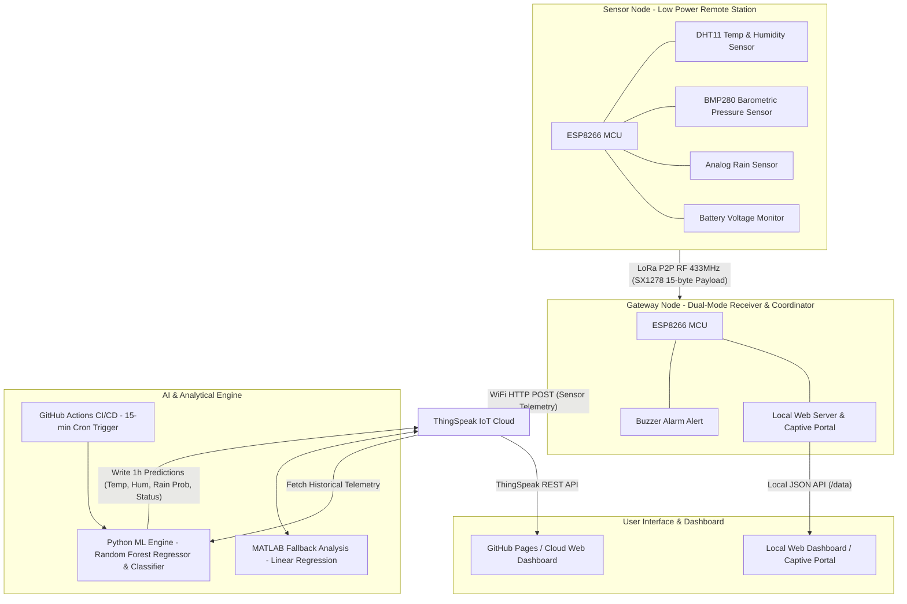

# 🌦️ Smart Weather Station IoT - LoRa P2P & AI Weather Forecasting System

[](https://github.com/dome-94/smart-weather-station-iot/actions/workflows/predict.yml)
[](https://github.com/dome-94/smart-weather-station-iot/actions/workflows/deploy.yml)
[](LICENSE)
[](https://www.python.org/)
[](https://www.espressif.com/)
[](https://thingspeak.com/)

An end-to-end **Smart Meteorological Observation & Weather Forecasting System** combining long-range, low-power **LoRa P2P (Peer-to-Peer)** wireless telemetry, a dual-mode **ESP8266 IoT Gateway**, cloud integration with **ThingSpeak**, and an automated **Machine Learning (Random Forest) Forecasting Pipeline** executed continuously via **GitHub Actions**.

The system features a lightweight, responsive **Web Dashboard** built with vanilla HTML5/CSS3/JavaScript (featuring Glassmorphism, Dark Mode, and zero-dependency SVG charts) capable of operating in both offline Local AP mode and live Cloud mode.

---

## 📑 Project Deliverables & Academic Documentation

| Document / Resource | Description | Direct Link |
| :--- | :--- | :---: |
| 📄 **Final Academic Report** | Full technical project report (PDF, 12.8 MB) | [Read Report (PDF)](docs/Report_Group1_SE2036_SU26.pdf) |
| 🎥 **Demonstration Video** | Full system operation demo video (Google Drive) | [Watch Video Demo](https://drive.google.com/file/d/11cMH0WwSyZTcYttvgiP_zKkVfedbLLi1/view?usp=sharing) |
| 📊 **Presentation Slides & Folder** | Slides (`.pptx`/`.pdf`) and course artifacts | [Open Drive Folder](https://drive.google.com/drive/folders/1S3p0Ww-17E4YuMg9cDz8nPTEcB69zPZF?usp=sharing) |
| 👥 **Team Contribution Matrix** | Detailed task allocation and member contributions | [View Contribution](docs/Contribution.docx) |
| 🤖 **AI Audit Logs** | Comprehensive AI usage tracking spreadsheets | [Browse Audit Logs](docs/ai_audit_logs/) |

---

## 📌 System Architecture



---

## 🚀 Key Highlights & Features

### 1. Long-Range Low-Power Telemetry (LoRa P2P)
- **SX1278 Ra-02 Transceiver (433MHz)** with packed 15-byte binary payload for minimal airtime and transmission overhead.
- Synchronization word (`0xAB`) filtering to prevent packet collisions and RF interference.
- **Deep Sleep Cycle (60s)** on the Sensor Node, enabling extended battery operation with solar harvesting capabilities.

### 2. Dual-Mode Intelligent Gateway
- **Simultaneous SoftAP + WiFi Station Mode**: Serves a local Captive Portal web interface directly to mobile devices in remote fields without Internet while connecting to WiFi to push telemetry to ThingSpeak.
- **Embedded Web Server**: In-memory optimized HTML/CSS/JS with zero external CDN dependencies, fully functional in air-gapped environments.
- **Threshold Hysteresis Buzzer Alert**: Immediate local auditory warning for critical temperature and rainfall anomalies.

### 3. Machine Learning Weather Forecasting (AI Engine)
- **Random Forest Models**: Trained on multi-year meteorological datasets (Ho Chi Minh City climate profiles) fetched from the Open-Meteo API.
- **Multi-Target Prediction**:
  - **Temperature Regressor**: Mean Absolute Error ($\text{MAE} \le 0.4^\circ\text{C}$).
  - **Humidity Regressor**: Mean Absolute Error ($\text{MAE} \le 2.4\%$).
  - **Weather Classification**: Accuracy $\approx 88\%$ (Sunny/Clear, Cloudy/Overcast, Rain/Storm).
- **Automated MLOps with GitHub Actions**: Scheduled workflow runs every **15 minutes** to ingest latest sensor feeds, engineer temporal lag features, compute forecasts, and update ThingSpeak channels.
- **MATLAB Analysis Backup**: Built-in fallback linear regression directly inside ThingSpeak to guarantee continuous prediction availability.

### 4. Modern Zero-Dependency Web Dashboard
- **Glassmorphic Dark Mode UI**: Modern visual layout with responsive cards and intuitive gauges.
- **Zero-Dependency SVG Real-Time Charts**: Self-rendered interactive graphs without external charting libraries, ensuring sub-second load times on embedded microcontrollers.
- **Smart Agricultural Advisory**: Automated farming recommendations tailored for tropical crops (e.g., durian root rot warnings, coffee rust disease prevention, irrigation schedules).

---

## 📂 Repository Structure

```text
smart-weather-station-iot/
├── .github/
│   └── workflows/
│       ├── predict.yml          # GitHub Actions workflow for scheduled ML inference (every 15 min)
│       └── deploy.yml           # GitHub Pages automated deployment workflow
├── docs/                        # Project documentation, academic reports & audit logs
│   ├── Report_Group1_SE2036_SU26.pdf # Full academic final report (PDF)
│   ├── Contribution.docx        # Member contribution breakdown
│   ├── links.md                 # External cloud links (Demo Video & Presentation Slides)
│   └── ai_audit_logs/           # AI usage audit logs per team member (.xlsx)
├── firmware/                    # Embedded C++ firmware for ESP8266 microcontrollers
│   ├── gateway_node/            # Gateway receiver, WiFi Captive Portal & ThingSpeak sync
│   │   ├── gateway_node.ino
│   │   ├── weather_html.h
│   │   ├── LoRa.cpp
│   │   ├── LoRa.h
│   │   └── data/
│   │       └── chart.min.js
│   └── sensor_node/             # Remote sensor node firmware & hardware drivers
│       ├── sensor_node.ino
│       ├── Adafruit_BMP280.cpp / .h
│       └── DHT.cpp / .h
├── ml_engine/                   # Python Machine Learning forecasting engine
│   ├── train.py                 # Script to train and evaluate Random Forest models
│   ├── predict_live.py          # Real-time inference script fetching ThingSpeak data & writing predictions
│   ├── simulate_device.py       # Hardware sensor telemetry emulator for testing
│   ├── simulate_gateway.py      # Gateway relay emulator for testing
│   └── requirements.txt         # Python package dependencies
├── models/                      # Pre-trained machine learning model artifacts (.joblib)
│   ├── feature_cols.joblib
│   ├── hum_model.joblib
│   ├── status_model.joblib
│   └── temp_model.joblib
├── matlab/                      # MATLAB analytics & visualization scripts
│   ├── matlab_analysis_forecast.m      # ThingSpeak MATLAB fallback regression
│   └── matlab_visualization_compare.m  # Multi-metric comparative visualization
├── data/                        # Training dataset & raw UI template
│   ├── historical_weather.csv   # Ho Chi Minh City climate historical dataset
│   └── viewWeatherStation.html  # Base UI template for dashboard compilation
├── compile_html.py              # Compiler bundling UI into index.html & weather_html.h
├── index.html                   # Production-ready standalone Web Dashboard (GitHub Pages root)
├── .env.example                 # Environment variables configuration template
├── .gitignore                   # Git ignore specifications (ignores .rar, .venv, temp files)
├── CONTRIBUTING.md              # Open source contribution guidelines
├── LICENSE                      # MIT License
└── README.md                    # Project documentation
```

---

## 🔌 Hardware Specifications & Pinout Mapping

### Bill of Materials (BOM)

| Component | Quantity | Role / Specification |
| :--- | :---: | :--- |
| **NodeMCU ESP8266 (ESP-12E/F)** | 2 | Microcontrollers for Sensor Node & Gateway Node |
| **SX1278 Ra-02 LoRa Module (433MHz)** | 2 | Long-range wireless SPI transceiver |
| **DHT11 / DHT22** | 1 | Digital temperature and relative humidity sensor |
| **BMP280** | 1 | I2C digital atmospheric barometric pressure sensor |
| **Raindrop Sensor (Analog)** | 1 | Resistive analog rain detection board |
| **Active 5V Buzzer** | 1 | Local audio alarm indicator on Gateway |
| **18650 Li-ion Battery + BMS** | 1 | Power source for remote Sensor Node |
| **AMS1117 3.3V Regulator / TP4056** | 1 | Power management and battery charging module |

### Pinout Connections

#### 1. Sensor Node (ESP8266 Transmitter)
| Peripheral Pin | ESP8266 Pin | Description |
| :--- | :--- | :--- |
| **SX1278 NSS / CS** | `D8` (GPIO15) | SPI Chip Select |
| **SX1278 RST** | `D0` (GPIO16) | Reset Pin (Wake from Deep Sleep) |
| **SX1278 DIO0** | `D1` (GPIO5) | Interrupt Request |
| **SX1278 SCK / MISO / MOSI** | `D5 / D6 / D7` | Hardware SPI Pins (GPIO14, GPIO12, GPIO13) |
| **BMP280 SDA / SCL** | `D2 / D1` (GPIO4 / GPIO5) | I2C Communication Bus |
| **DHT11 DATA** | `D4` (GPIO2) | 1-Wire Digital Signal |
| **Rain Sensor AO** | `A0` (ADC0) | Analog Rain Level (0 - 1023) |

#### 2. Gateway Node (ESP8266 Receiver)
| Peripheral Pin | ESP8266 Pin | Description |
| :--- | :--- | :--- |
| **SX1278 NSS / CS** | `D8` (GPIO15) | SPI Chip Select |
| **SX1278 RST** | `D0` (GPIO16) | Reset Pin |
| **SX1278 DIO0** | `D1` (GPIO5) | Interrupt Request |
| **SX1278 SCK / MISO / MOSI** | `D5 / D6 / D7` | Hardware SPI Pins |
| **Active Buzzer** | `D2` (GPIO4) | Active High Alarm Trigger |

---

## 📊 ThingSpeak IoT Channel Configuration

Configure your ThingSpeak channel fields according to the following mapping schema:

| Channel Field | Metric Name | Unit | Data Source |
| :--- | :--- | :---: | :--- |
| **Field 1** | Ambient Temperature | $^\circ\text{C}$ | Gateway Node (Sensor) |
| **Field 2** | Relative Humidity | $\%$ | Gateway Node (Sensor) |
| **Field 3** | Barometric Pressure | $\text{hPa}$ | Gateway Node (Sensor) |
| **Field 4** | Rain Detection Index | $0 - 1023$ | Gateway Node (Sensor) |
| **Field 5** | Sensor Node Battery Level | $\%$ | Gateway Node (Sensor) |
| **Field 6** | Predicted Temperature (+1h) | $^\circ\text{C}$ | Python AI / MATLAB |
| **Field 7** | Rain Probability (+1h) | $\%$ | Python AI / MATLAB |
| **Field 8** | Predicted Humidity (+1h) | $\%$ | Python AI / MATLAB |

---

## ⚙️ Quickstart & Setup Guide

### 1. Firmware Installation (Arduino IDE)

1. Install [Arduino IDE](https://www.arduino.cc/en/software) (version 1.8.x or 2.x).
2. Add ESP8266 Board Manager URL in **Preferences**:
   ```
   http://arduino.esp8266.com/stable/package_esp8266com_index.json
   ```
3. Install required libraries via **Library Manager**:
   - `LoRa` by Sandeep Mistry
   - `DHT sensor library` by Adafruit
   - `Adafruit BMP280 Library`
   - `Adafruit Unified Sensor`
4. Open `firmware/gateway_node/gateway_node.ino`:
   - Set `staSsid` and `staPassword` to your local 2.4GHz WiFi network.
   - Set `THINGSPEAK_API_KEY` to your ThingSpeak Write API Key.
   - Flash to your Gateway ESP8266 board.
5. Open `firmware/sensor_node/sensor_node.ino` and flash to your Sensor ESP8266 board.

---

### 2. Python Machine Learning Engine

Ensure you have **Python 3.10+** installed on your system.

```bash
# Clone the repository
git clone https://github.com/dome-94/smart-weather-station-iot.git
cd smart-weather-station-iot

# Create and activate virtual environment
python -m venv .venv
source .venv/bin/activate  # On Windows: .venv\Scripts\activate

# Install dependencies
pip install -r ml_engine/requirements.txt

# (Optional) Re-train Machine Learning models from scratch
python ml_engine/train.py

# Run live inference pipeline
python ml_engine/predict_live.py
```

---

### 3. GitHub Actions Setup (Automated 15-Minute MLOps)

To enable automatic continuous forecasting:
1. Navigate to your GitHub Repository $\rightarrow$ **Settings** $\rightarrow$ **Secrets and variables** $\rightarrow$ **Actions**.
2. Add the following **Repository Secrets**:
   - `THINGSPEAK_CHANNEL_ID`: Your numeric ThingSpeak Channel ID.
   - `THINGSPEAK_READ_KEY`: Your Channel Read API Key.
   - `THINGSPEAK_WRITE_KEY`: Your Channel Write API Key.
3. The `.github/workflows/predict.yml` cron will automatically execute every 15 minutes, query sensor telemetry, infer forecasts, and update ThingSpeak fields 6, 7, and 8.

---

### 4. Running the Web Dashboard

- **Standalone Browser**: Double-click `index.html` to run the dashboard locally in your web browser.
- **GitHub Pages**: Automatically hosted at `https://<your-username>.github.io/<repo-name>/`.
- **Local AP Mode**: Connect your smartphone/PC to the WiFi AP named `WeatherStation` (Password: `12345678`) and open `http://192.168.4.1`.

If modifying UI styles or scripts in `data/viewWeatherStation.html`, run the compiler to synchronize both `index.html` and `firmware/gateway_node/weather_html.h`:
```bash
python compile_html.py
```

---

## 📈 Model Performance & Validation

The Random Forest architecture was trained on over 26,000 meteorological records from Ho Chi Minh City climate logs:

| Target Parameter | Model Architecture | Metric | Result |
| :--- | :--- | :--- | :--- |
| **Temperature (+1h)** | `RandomForestRegressor(n_estimators=100)` | MAE / $R^2$ | **$0.38^\circ\text{C}$** / $0.982$ |
| **Humidity (+1h)** | `RandomForestRegressor(n_estimators=100)` | MAE / $R^2$ | **$2.32\%$** / $0.965$ |
| **Weather Status (+1h)** | `RandomForestClassifier(n_estimators=120)` | Accuracy / F1-Score | **$88.4\%$** / $0.879$ |

---

## 🤝 Contributing

Contributions are welcome! Please review [CONTRIBUTING.md](CONTRIBUTING.md) for detailed guidelines on opening issues, feature requests, and submitting pull requests.

---

## 📄 License

This project is licensed under the **MIT License** - see the [LICENSE](LICENSE) file for details.

---

## 👥 Authors & Academic Credits

- **Course**: IOT102 (Internet of Things) - FPT University
- **Class / Group**: SE2036 - Group 1 (Summer 2026)
- **Members**:
  - Huynh Nhat ([@HNyat](https://github.com/HNyat))
  - Tran Trong Long
  - Ha Duc Thinh
  - Doan Cong Bang
